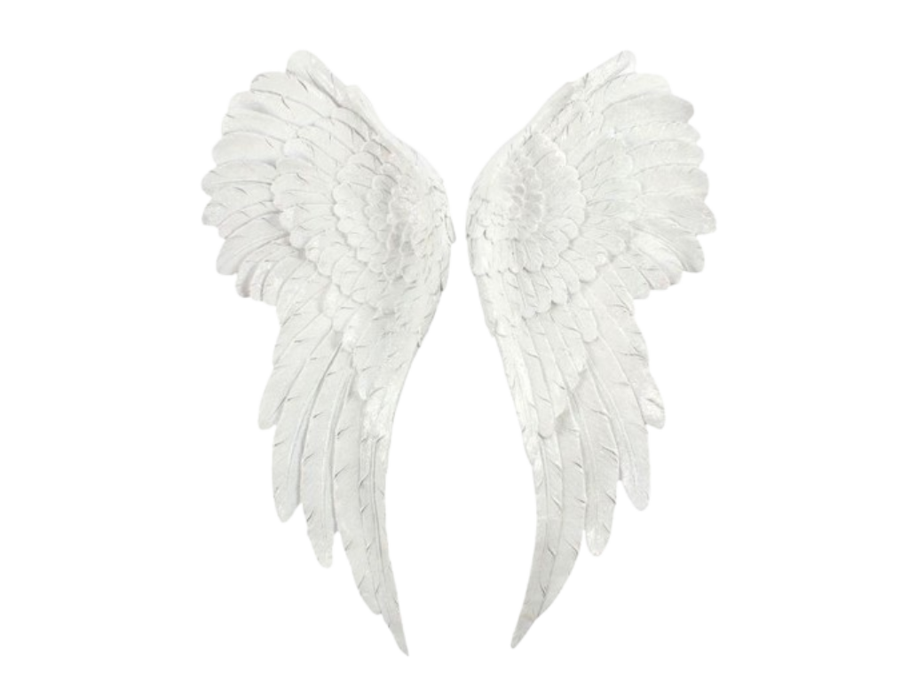

# 𓆩 ✦ 𓆪 𝑯𝒆𝒍𝒍𝒐, 𝑰'𝒎 𝑨𝒍𝒆𝒔𝒔𝒂𝒏𝒅𝒓𝒂 𓆩 ✦ 𓆪

 

### Computer Science · Data · Technology
˚₊‧꒰ა ☆ ໒꒱ ‧₊˚

 

###  `𓆩♡𓆪 ABOUT ME 𓆩♡𓆪`

"Somewhere between the stars and the machine."

I'm a Computer Science student fascinated by the intersection of technology, creativity and science.

I'm currently exploring different areas of software development while building projects and figuring out where I want to take my code next.

✦ things that interest me
╭───────────────────────────────╮                   
│   ☽ Process and Automation                   │
│  ✦ Data & Technology                        │
│   𓆩 Creative Coding                          │
╰──────────────────────────────────────────────╯

 

### ` 𓆩 ⚙ 𓆪 TECH ARSENAL 𓆩 ⚙ 𓆪`

<table>
<tr>
<td width="50%" valign="top">

### 💻 Languages

`SQL`

</td>

<td width="50%" valign="top">

### 📊 Data & Analytics

`Pandas` · `NumPy`

`Power BI` · `Excel`

</td>
</tr>

<tr>
<td width="50%" valign="top">

### 🗄️ Databases

</td>

<td width="50%" valign="top">

### 🛠️ Tools & Platforms

`ServiceNow` · `SharePoint` · `Trello`

</td>
</tr>
</table>

 

## `ACTIVITY`

